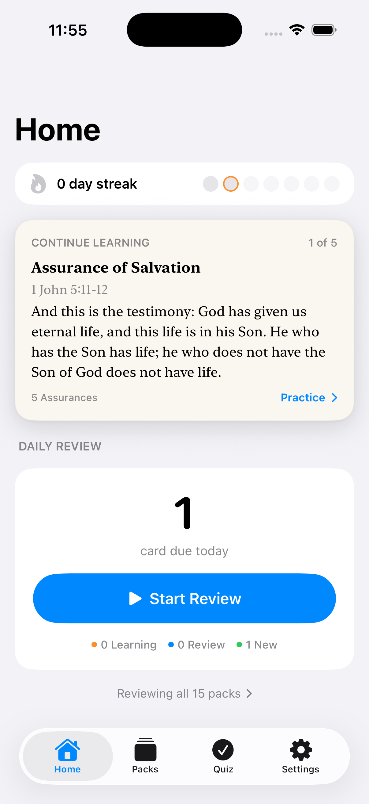
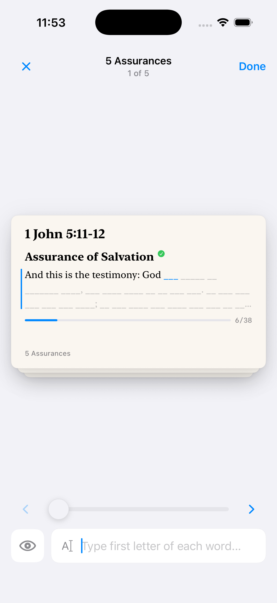
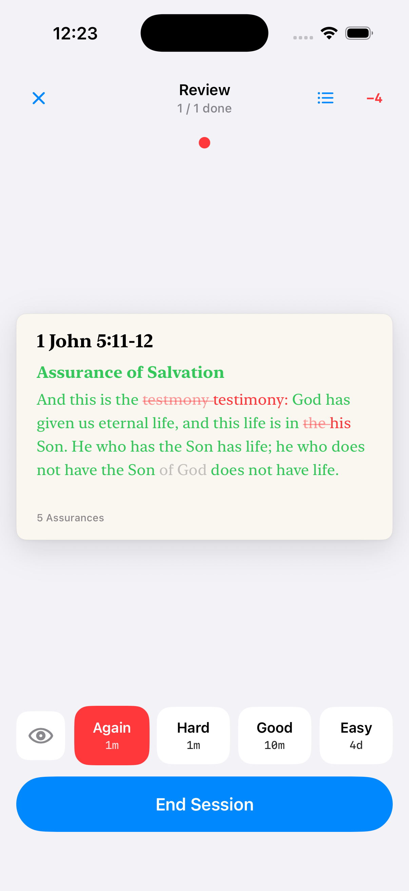
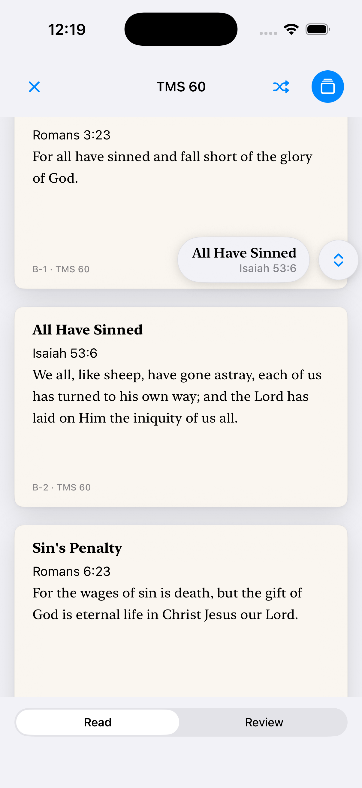

# Scripture Memory

An iOS app for memorizing Bible verses with spaced repetition. Built with SwiftUI.


<br />
[](https://github.com/joelwongjy/scripture_memory/actions/workflows/ci.yml)


[](LICENSE)

## Features

- **Spaced repetition.** An SM-2 style scheduler decides when each verse is due. Intervals get longer as a verse sticks and shorter when you miss it.
- **Practice modes.** A read mode for studying, plus three recall modes that have you type the verse with increasing difficulty: First Letter, Full Word, and Entire Verse.
- **Type or speak.** Recite verses out loud with on-device speech recognition, or type them. Typed answers get a word-level diff marking missing, extra, and wrong words.
- **Streaks and daily limits.** A weekly activity strip, and configurable caps for new cards and reviews per day.
- **Home-screen widgets.** A verse widget and a progress widget, each deep-linking back into the app.
- **Two translations.** NIV 1984 and NIV 2011, switchable at any time. Progress is shared across both.
- **iCloud sync.** Review progress syncs across devices. No account required.
- **Offline.** No network calls, no third-party SDKs, no tracking.

## Screenshots

<table>
  <tr>
    <td align="center"></td>
    <td align="center"></td>
    <td align="center"></td>
    <td align="center"></td>
  </tr>
  <tr>
    <td align="center"><sub>Home — streak, current verse, what's due</sub></td>
    <td align="center"><sub>First-letter practice</sub></td>
    <td align="center"><sub>Review with diff feedback</sub></td>
    <td align="center"><sub>Reading a pack</sub></td>
  </tr>
</table>

## How spaced repetition works

The scheduler is an SM-2 port in [`SRSAlgorithm.swift`](scripture%20memory/Model/SRSAlgorithm.swift). Each card is in one of two phases:

```
        ┌──────────────┐   Good ×N    ┌────────────┐
  new → │   LEARNING   │ ───────────► │   REVIEW   │
        │ short steps  │  graduate    │ days→weeks │
        └──────┬───────┘              └─────┬──────┘
               │ Again                 Again│ (lapse)
               └◄──────────────────────────┘
```

- **Learning** — the verse moves through short, fixed steps. Again resets it to the first step; Good advances; Easy graduates it straight to review.
- **Review** — the interval is multiplied by the card's ease factor. Good keeps the pace, Hard shortens it, Easy lengthens it, and Again sends the card back to learning with an ease penalty.
- After you recite a verse, its accuracy suggests a grade — a clean recall maps to Good, a few slips to Hard, a miss to Again. You can override it.

Typed answers are compared against the target with a word-level diff ([`DiffEngine.swift`](scripture%20memory/Model/DiffEngine.swift)) based on edit distance. Matching is case- and punctuation-insensitive.

## Content

483 verses across 15 packs, in both translations, from The Navigators' discipleship material:

- **Topical Memory System** — `TMS 60` and the five `TMS 180` series.
- **Design for Discipleship** — 8 packs (`DEP 1`–`DEP 8`).
- **5 Assurances** — a short starter pack.

Verses are stored as JSON: [`verseData.json`](scripture%20memory/Resources/verseData.json) (NIV 1984) and [`verseDataNIV11.json`](scripture%20memory/Resources/verseDataNIV11.json) (NIV 2011).

## Requirements

- macOS with Xcode 15+
- iOS 17+ device or simulator
- Swift 5.9+

## Build

```bash
git clone https://github.com/joelwongjy/scripture_memory.git
cd scripture_memory
open "Scripture Memory.xcodeproj"
```

Select the **Scripture Memory** scheme and run (`⌘R`).

To run on a device, set your own development team under *Signing & Capabilities*. The app and widget use an App Group and iCloud entitlements, which Xcode can register for you.

## Tests

The scheduling, diffing, tokenizing, and pack-ordering logic lives in a pure-Foundation Swift package (`SRSCore`) with 74 unit tests. It has no UI dependencies, so the suite runs without Xcode or a simulator:

```bash
swift test
```

This is what [CI](.github/workflows/ci.yml) runs on every push, in a `swift:6.0` Linux container.

## Project structure

```
scripture_memory/
├── Package.swift                  # SRSCore — pure logic, Linux-testable
├── Scripture Memory.xcodeproj/    # the iOS app
├── scripture memory/
│   ├── App.swift                  # entry point
│   ├── Model/                     # scheduler, diff, stores, queues (mostly pure)
│   ├── Views/                     # SwiftUI screens (Home, Packs, Quiz, Settings)
│   ├── Utilities/                 # haptics, widget bridge, helpers
│   └── Resources/                 # the verse catalogues (JSON)
├── ScriptureWidget/               # WidgetKit extension (verse + progress widgets)
└── Tests/SRSCoreTests/            # 74 tests against SRSCore
```

The app and widget share data through an App Group: the app writes a snapshot (current verse, streak, due count, weekly activity) and the widget reads it back.

## Privacy

The app collects no data. There is no networking, there are no third-party SDKs, and there is no account. Data stays on the device (`UserDefaults`) and in your own iCloud. The App Store privacy label is "Data Not Collected".

## License

MIT — see [LICENSE](LICENSE). The MIT license covers the application code only. Scripture text (NIV) and the Topical Memory System / Design for Discipleship content remain the property of their respective copyright holders.

## Credits

- Content is based on The Navigators' Topical Memory System and Design for Discipleship. This is an independent project, not affiliated with or endorsed by The Navigators.
- Scripture text: New International Version (NIV), 1984 and 2011 editions.
